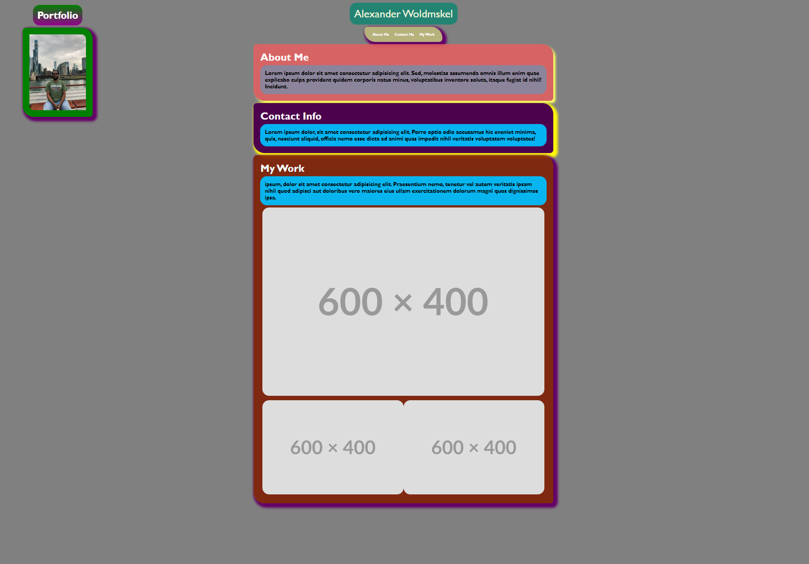

# AWportfolio
This is my portfolio
I've met all criteria for this assignment. 

here are links to the github and the webpage
as well as a screenshot of the page. 

The URL of the deployed application.

https://alexwoldmskel.github.io/AWportfolio/ 
to an external site.

 

The URL of the GitHub repository that contains your code. Give the repository a unique name and include a README file that describes the project.

https://github.com/AlexWoldmskel/AWportfolio 
to an external site.

 

